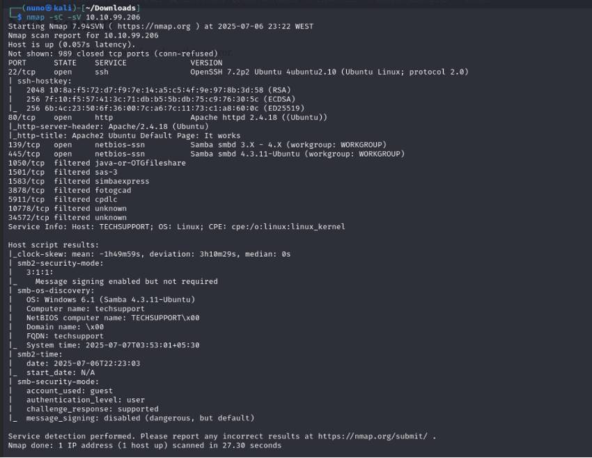
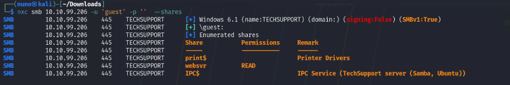
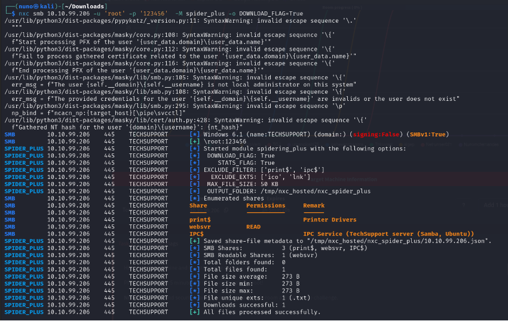
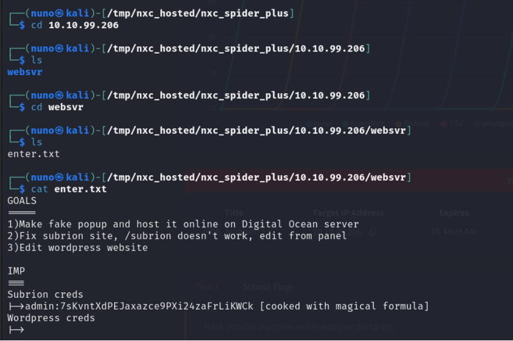
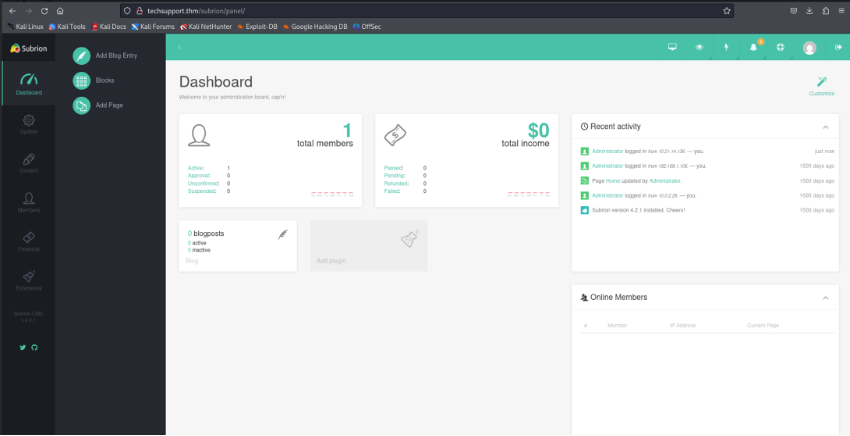
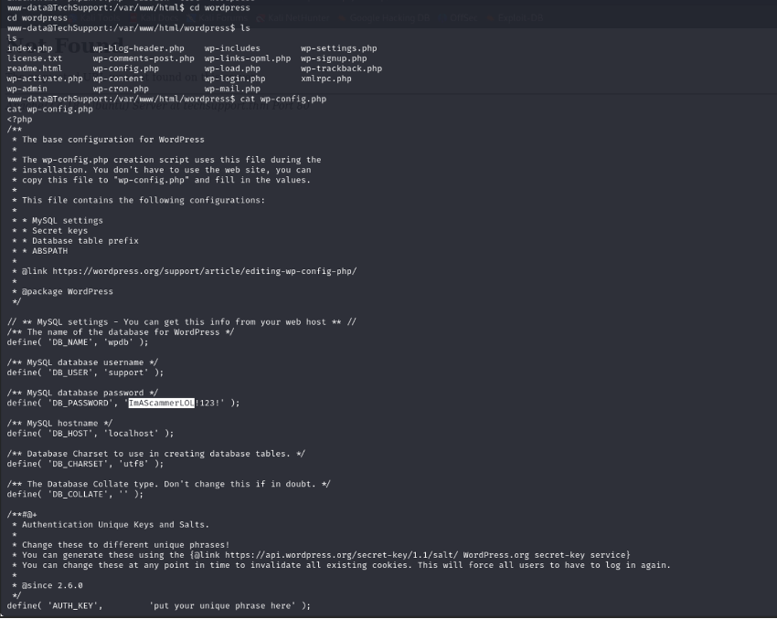
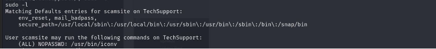
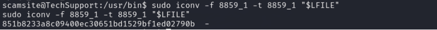

# 📦 Tech_Support CTF Walkthrough TryHackMe

## 🔍 Initial Recon - `nmap`

We start with an `nmap` scan to enumerate open ports and services. This revealed a Samba (SMB) service running on the target machine. Samba is often misconfigured and can allow unauthenticated access or give away useful information.




## 🎯 Targeting SMB - Enumeration with `netexec` (NXC)

Using [`netexec`](https://github.com/Pennyw0rth/NetExec) (formerly CrackMapExec), we check for accessible shares using the guest account:

```bash
netexec smb <target-ip> -u '' -p '' --shares
```




## Readind the Share Folders

```bash
netexec smb <target-ip> -u root -p 123456 --shares -M spider_plus -o DOWNLOAD_FLAG=True

```


After readind the file on the folder of NXC we found a pair of creds:


***(DECODE ON CYBERCHEF)***
admin:Scam2021

## Subrion CMS Discovery

A quick Google search reveals that Subrion is an open-source CMS. Browsing its GitHub repo or documentation helps identify potential admin panel URLs, e.g.:

http://<target-ip>/subrion/panel/



## Subrion CMS Exploit - Remote Shell

https://exploit-notes.hdks.org/exploit/web/cms/subrion-cms-pentesting/

Following the steps from the exploit note, we execute a reverse shell payload through the vulnerable admin panel.

We now have remote code execution on the server.

# WordPress Discovery
We identify a WordPress installation running on the box. Checking the wp-config.php file gives us access to database credentials or additional user info.
We also find a user called scamsite listed in /etc/passwd.


## Privesc

sudo -l


We find that ***iconv*** is available as a sudo-enabled binary.
https://gtfobins.github.io/gtfobins/iconv/

sudo iconv -f 666 -t 666 /root/root.txt



## Box Pwned


